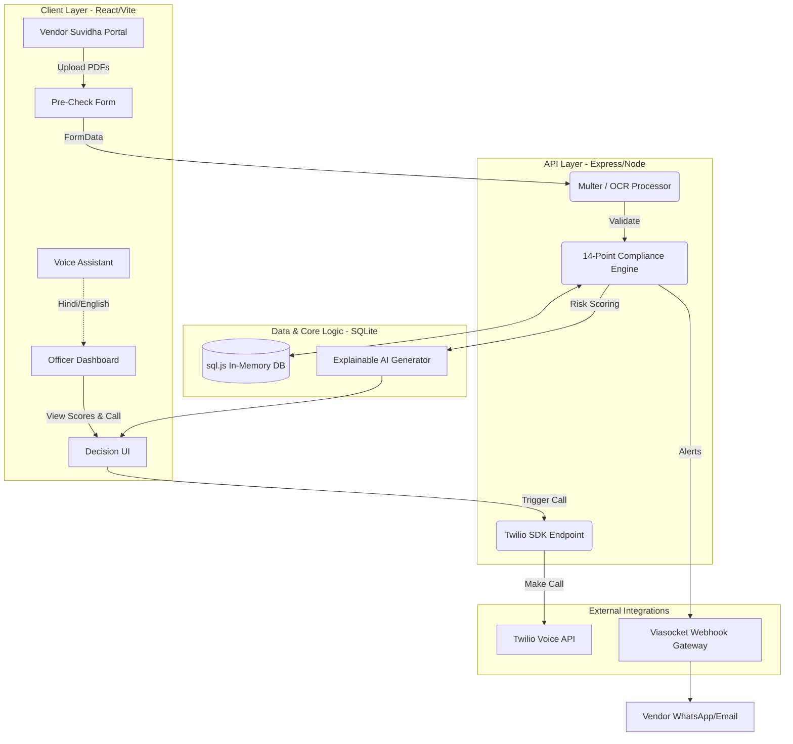

# 🏆 BidVerify AI: Intelligent Bid Compliance System
**Smart India Hackathon 2026 | Problem Statement: 26100 (Ministry of Petroleum & Natural Gas / CPCL)**

BidVerify AI is a next-generation, AI-enabled integrated platform designed to automate the verification of bidder compliance in GeM procurement. By shifting from a punitive, manual verification process to an active, AI-assisted workflow, we empower MSMEs while reducing procurement officer workload to near-zero.

---

## 🌟 Why We Are Doing This (The "Wow" Factor)
Past SIH winners succeeded because they didn't just digitize a form—they reinvented the process. We identified that GeM portals are highly exclusionary to rural MSMEs and manually exhausting for PSU officers. 

**Our Solution doesn't just read documents, it actively cures them:**
1. **Vendor "Suvidha" Landing Page:** A Shift-Left approach. Vendors pre-validate their own PDFs before the officer ever sees them.
2. **Proactive Active Bid Curing:** Instead of rejecting bids blindly, the AI alerts vendors via Viasocket webhooks *before* deadlines if a document is expired.
3. **Twilio AI Voice Caller:** Fully automated outbound phone calls to vendors alerting them of missing MSME/GST certificates.
4. **Explainable AI (XAI):** Officers don't trust black boxes. Our UI highlights the exact clause in the 50-page PDF that matches the statutory requirement.
5. **Vernacular Voice Assistant:** Built-in Hindi/English voice commands for ultimate accessibility.

---

## 🎯 Addressing the 14-Point Problem Statement
BidVerify AI maps directly to the CPCL requirements:
1. **Govt Portal Integration:** Mock Webhook layer (API-Ready for GeM/CPPP).
2. **Udyam/MSME:** Strict Regex & PDF OCR validation.
3. **GST Registration:** 15-character statutory GSTIN matching.
4. **PAN & Income Tax:** 10-character CBDT format and ITR turnover extraction.
5. **Make in India:** Local content affidavit verification.
6. **EPFO/ESIC:** Statutory code detection.
7. **Startup India/NSIC/OEM:** Authorization letter validation.
8. **DigiLocker:** API Setu architectural readiness.
9. **Blacklisting:** Database cross-reference checking.
10. **Tender-Specific Checks:** Dynamic criteria extraction.
11. **AI Missing Info Detection:** Highlighted instantly in the dashboard.
12. **Compliance Score & Risk Level:** Dual radial gauges in UI.
13. **AI Recommendation:** Auto-generated summaries for the Procurement Officer.
14. **Auditable Record:** Cryptographic Web Crypto SHA-256 hashes & SQLite audit trails.

---

## 🏗️ 3D Architecture & Data Flow

---

## 💻 Tech Stack (Government-Centric)
*   **Frontend:** React 18, Vite, TailwindCSS (Fast, scalable, secure static builds).
*   **Backend:** Node.js, Express (Event-driven, handles concurrent PDF uploads easily).
*   **Database:** SQLite / sql.js (File-backed, ensures data localization and fast read/writes without complex cloud infra).
*   **AI & OCR:** Custom PDF parsing and Keyword/Regex Extractor (Server-side to ensure sensitive PII never leaves Indian bounds).
*   **Telephony & Alerts:** Twilio Programmable Voice & Viasocket Webhooks.
*   **Security:** Native Web Crypto API (SHA-256) for document integrity.

## 🚀 How to Run
1. `cd backend && npm install && node src/server.js` (Runs on port 5000)
2. `cd frontend && npm install && npm run build && npm run dev`
3. Access Officer Dashboard at `localhost:5173`
4. Access Vendor Portal at `localhost:5173/vendor`
