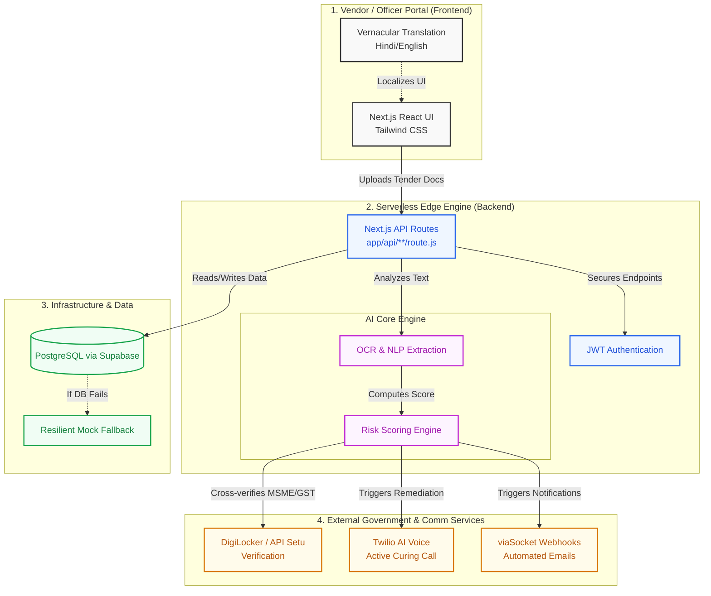

<div align="center">
  
  
  # Bidकेन्द्र (Bidkendra) — from finding to filing
  
  **AI-Enabled Automated Bidder Compliance Verification for GeM Procurement**  
  *Problem Statement 26100 | Ministry of Petroleum & Natural Gas / CPCL | SIH 2026*
</div>

<br/>

## 📖 Why We Are Doing This (The Problem)

Government e-Marketplace (GeM) handles massive volumes of procurement across India. For PSUs like **Chennai Petroleum Corporation Limited (CPCL)**, verifying bidder compliance is a highly manual, time-consuming, and error-prone process. Procurement officers must manually cross-check vendor declarations across 14+ different statutory domains (GST, PAN, MSME, Make in India, EPFO, etc.). 

This manual process leads to:
- **Delayed Procurements** and operational bottlenecks.
- **Human Error** overlooking critical statutory non-compliance.
- **Vendor Disqualification** for minor, curable defects.

## 🚀 What We Built (The Solution)

**Bidकेन्द्र (Bidkendra)** is an end-to-end, AI-powered automation platform that acts as an intelligent co-pilot for CPCL Procurement Officers. 

1. **Automated Verification**: It uses NLP and OCR to extract entities from tender documents and cross-verifies them against live Government databases (DigiLocker, API Setu).
2. **14-Point Statutory Scorecard**: Generates an instant, mathematically weighted "Compliance Score" and "Risk Level".
3. **Active Bid Curing**: If a defect is curable, our Twilio AI Voice Agent automatically calls the vendor in their regional language, while viaSocket dispatches an automated webhook email giving them 48 hours to fix it.
4. **Explainable AI (XAI)**: Procurement officers don't just get a "Pass/Fail"; they get a granular, legally auditable breakdown of exactly *why* the AI made its decision.

---

## 🏗️ 3D Architecture & Workflow

We utilize a **Unified Full-Stack Architecture** powered by Next.js App Router for zero-latency serverless execution on Vercel.



---

## 🛠️ Technology Stack

| Category | Technology Used | Why We Used It |
| :--- | :--- | :--- |
| **Frontend UI** | React 18, Next.js 14, Tailwind CSS | For lightning-fast SSR, highly responsive CPCL-themed layouts, and zero-flicker routing. |
| **Backend API** | Next.js Serverless Route Handlers | To eliminate separate Express.js server conflicts and deploy seamlessly on Vercel Edge Networks. |
| **Database** | PostgreSQL (Supabase) | Highly scalable relational database for ACID compliant tender and bidder records. |
| **Automations** | Twilio API, viaSocket Webhooks | To implement the "Active Bid Curing" module via voice calls and instant email dispatch. |
| **AI/NLP Engine** | Explainable AI (XAI) Logic | To provide transparent, auditable decision breakdowns for procurement officers. |

---

## ⚙️ Local Development Guide

```bash
# 1. Clone the repository and navigate to the unified app directory
git clone https://github.com/palvendrachoudhary/Bidkendra.git
cd Bidkendra/unified-app

# 2. Install dependencies
npm install

# 3. Start development server
npm run dev

# 4. Open in browser
http://localhost:3000
```

## ☁️ Vercel Deployment

Deploying this unified Next.js application to Vercel is seamless because Next.js is Vercel's native framework:

1. Push this repository to GitHub.
2. In Vercel, import the repository.
3. Set **Root Directory** to `unified-app`.
4. **Framework Preset**: `Next.js` (automatically detected).
5. Add the following **Environment Variables** in Vercel Project Settings:
   - `DATABASE_URL`: `postgresql://...supabase.co:5432/postgres`
   - `VIASOCKET_WEBHOOK_URL`: `https://flow.sokt.io/func/...`
   - `TWILIO_ACCOUNT_SID`: Your Twilio SID (Required for live voice calls)
   - `TWILIO_AUTH_TOKEN`: Your Twilio Auth Token
   - `TWILIO_PHONE_NUMBER`: Your Twilio Phone Number
6. Click **Deploy**!

*(Note: If Twilio credentials are omitted, the platform gracefully falls back to "Simulated Demo Mode" for uninterrupted hackathon presentations).*

<br/>
<div align="center">
  <b>Built with ❤️ for SIH 2026</b>
</div>
